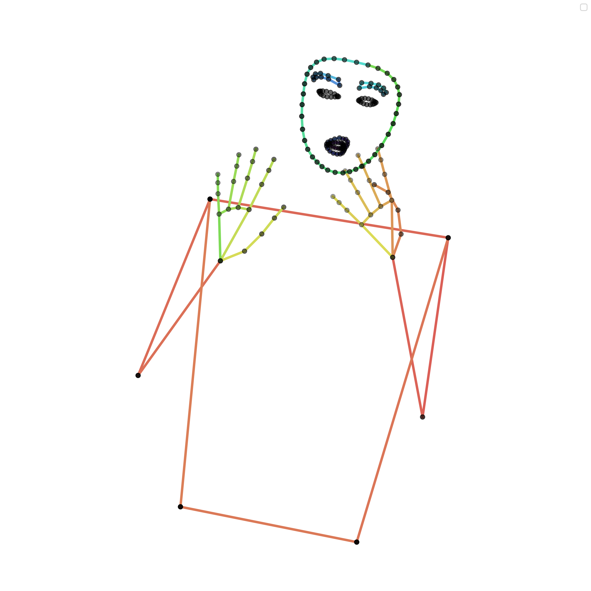

# SLRTP_CVPR_2025_Challenge_Code
Helpful code for the Sign Language Production Challenge for the SLRTP CVPR workshop

See **./keypoint_def.py** for keypoint labels

# Skeleton Visualization
 
Run the following command to install the required packages:
```bash
pip install torch matplotlib
```

Change line 13 in main.py to the path to the .pt pose data e.g. 
```python
pred = torch.load('./data/phix/dev.pt')
```

Run the following to plot an example: 
```bash
python plot_skeleton.py
```

See pose.png for an exmaple of the output.

